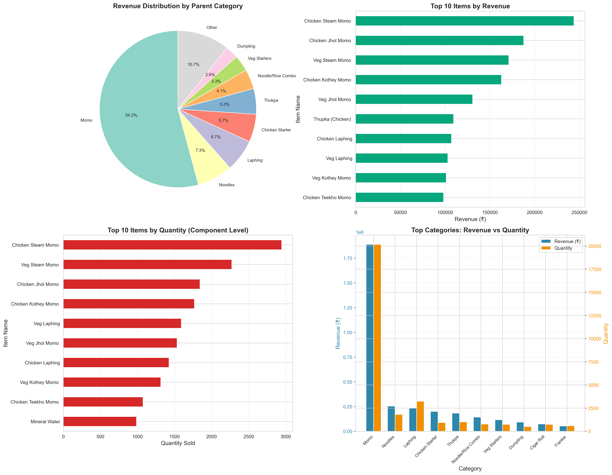
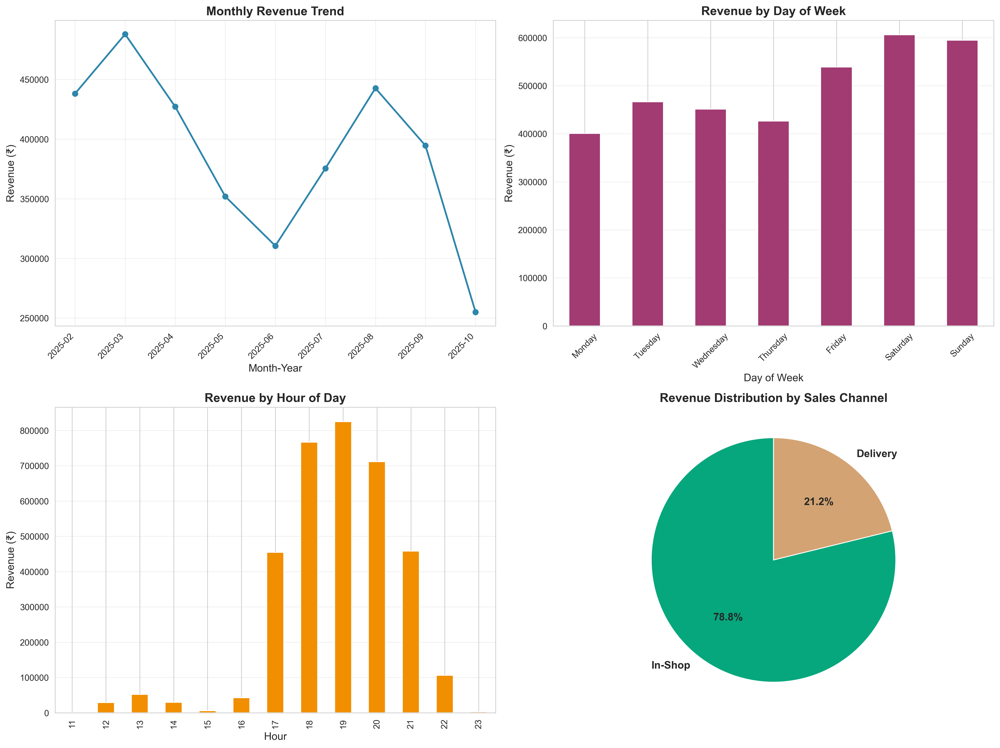
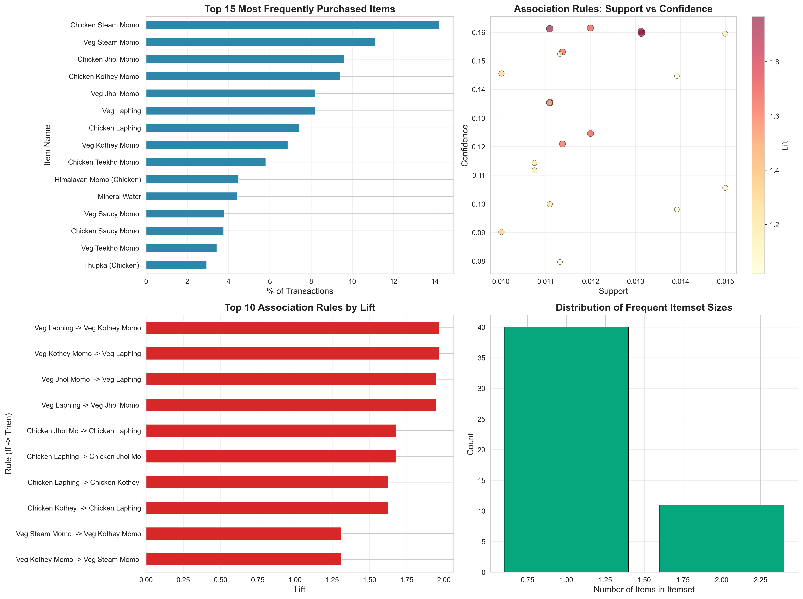
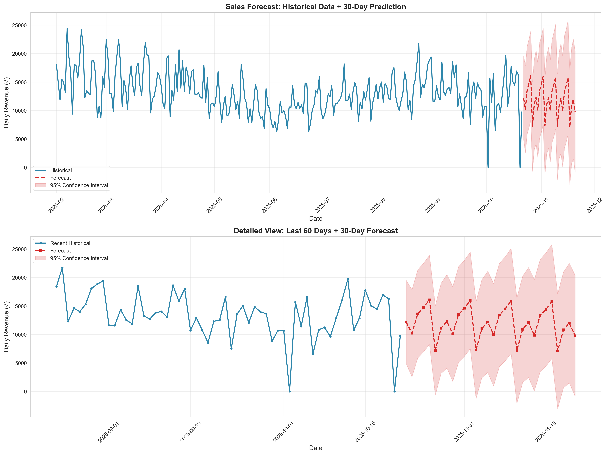

# 📊 VDD Sales Analysis Dashboard

An interactive, real-time sales analytics dashboard built with Streamlit. Analyze your sales data, forecast revenue, generate weekly targets, and share insights with your team - all accessible from any device!


---

## 🌟 Key Features

### 📈 **Comprehensive Analytics**
- **Overview Dashboard**: Sales channel distribution, category performance
- **Top Products Analysis**: Best-selling items by revenue and quantity
- **Time-Based Insights**: Performance by day, hour, week, and month
- **Revenue & Discount Analysis**: Track net revenue, discounts, and AOV
- **Trend Analysis**: Month-on-month growth with detailed metrics

### 🔮 **Forecasting & Planning**
- **Revenue Forecasting**: SARIMAX-based daily revenue predictions
- **Weekly Unit Forecasting**: Predict unit sales for next 2 weeks
- **Smart Adjustments**: Apply growth factors for festivals/campaigns
- **Staffing Insights**: Week-of-month analysis for resource planning

### 🛒 **Advanced Features**
- **Basket Analysis**: Market basket analysis with association rules
- **Multi-Outlet Support**: Filter by KV, Patia, or view all outlets
- **Category Drill-Down**: Navigate from parent → sub-category → item
- **Combo Item Handling**: Properly explodes combo items for accurate unit counts

### 📱 **Mobile-Friendly**
- **WhatsApp Integration**: Generate targets in WhatsApp-friendly format
- **Responsive Design**: Works on desktop, tablet, and mobile
- **Quick Share**: Copy-paste formatted reports
- **CSV Downloads**: Export any analysis for offline use

### 🔄 **Real-Time Data**
- **Google Sheets Integration**: Update data from anywhere
- **Auto-Refresh**: Data syncs every 5 minutes
- **Manual Refresh**: Button to force immediate update
- **Dual Source**: Falls back to local Excel if needed

---

## 🚀 Quick Start

### Option 1: Run Locally with Excel File

```bash
# Clone the repository
git clone https://github.com/YOUR_USERNAME/VDDForecast_2025.git
cd VDDForecast_2025

# Install dependencies
pip install -r requirements.txt

# Run the dashboard
python -m streamlit run dashboard.py
```

Then open your browser to: **http://localhost:8501**

### Option 2: Deploy Online with Google Sheets

See detailed guides:
- 📊 [Google Sheets Setup Guide](GOOGLE_SHEETS_SETUP.md)
- 🚀 [Deployment Guide](DEPLOYMENT_GUIDE.md)

---

## 📦 Project Structure

```
VDDForecast_2025/
│
├── dashboard.py              # Main Streamlit application
├── data.xlsx                 # Local sales data (optional)
├── requirements.txt          # Python dependencies
│
├── .streamlit/
│   ├── config.toml          # Streamlit configuration
│   └── secrets.toml.example # Example credentials file
│
├── analysis_outputs/         # Generated analysis charts
│   ├── 01_time_channel_analysis.png
│   ├── 02_category_product_performance.png
│   ├── 03_basket_analysis.png
│   └── 04_sales_forecast.png
│
├── README.md                 # This file
├── DEPLOYMENT_GUIDE.md       # How to deploy online
├── GOOGLE_SHEETS_SETUP.md    # Google Sheets integration
└── ANALYSIS_SUMMARY_REPORT.md # Analysis documentation
```

---

## 📊 Required Data Structure

Your data file (Excel or Google Sheets) must have **3 sheets**:

### 1. **SalesData** Sheet
Required columns:
- `Date`, `Timestamp`, `Invoice No.`, `Item Name`, `Qty.`, `Price`
- `Sub Total`, `Discount`, `Tax`, `Final Total`, `Status`
- `Area`, `Outlet`, `Sales Channel` (or `Online / Offline`)

### 2. **nameRef** Sheet
Columns:
- `Item`, `Real Name`, `Parent`, `Sub Category`

### 3. **comboRef** Sheet
Columns:
- `Item Name`, `Real Item Name`, `Category`, `Sub Category`

**💡 Tip**: Export your current Excel sheets to Google Sheets maintaining the exact same structure!

---

## 🎯 Dashboard Tabs

### 📈 Tab 1: Overview
- Sales channel pie charts and AOV comparison
- Top 10 categories by revenue and quantity
- Quick summary metrics

### 🏆 Tab 2: Top Products
- Top 15 products by revenue
- Top 15 products by quantity
- Detailed rankings with interactive charts

### ⏰ Tab 3: Time Analysis
- Revenue trends over time
- Day-of-week patterns
- Week-of-month analysis for staffing
- Hourly performance breakdown

### 💰 Tab 4: Net Revenue & Discounts
- Discount analysis by channel
- Gross vs Net AOV comparison
- Monthly discount trends
- Key discount insights

### 📊 Tab 5: Trends Analysis
- Month-on-month units and revenue
- Advanced filtering (outlet, category, item)
- Growth rate calculations
- Trend direction indicators

### 🔗 Tab 6: Basket Analysis
- Frequent itemset mining
- Association rules (if X, then Y)
- Product affinity insights
- Cross-selling opportunities

### 🔮 Tab 7: Revenue Forecast
- SARIMAX time series forecasting
- Daily revenue predictions
- Confidence intervals
- Customizable forecast periods (7-90 days)

### 📦 Tab 8: Weekly Unit Forecast
- Next 2 weeks unit predictions
- Day-by-day breakdown (Monday-Sunday)
- Launch date-aware calculations
- Adjustment factors for campaigns

### 📱 Tab 9: Send Targets
- WhatsApp-friendly format
- Pre-selected key categories
- 2-week targets at a glance
- One-click copy functionality

---

## 🔧 Installation

### Prerequisites
- Python 3.8 or higher
- pip (Python package manager)

### Install Dependencies

```bash
pip install -r requirements.txt
```

### Dependencies Include:
- `streamlit` - Web dashboard framework
- `pandas` - Data manipulation
- `plotly` - Interactive charts
- `mlxtend` - Market basket analysis
- `statsmodels` - Time series forecasting
- `gspread` - Google Sheets integration
- `google-auth` - Authentication for Google APIs

---

## 🌐 Google Sheets Setup (Optional but Recommended)

Benefits of using Google Sheets:
- ✅ Update data from anywhere
- ✅ No need to redeploy after data changes
- ✅ Team collaboration on data entry
- ✅ Automatic backups
- ✅ Version history

**Full Setup Guide**: [GOOGLE_SHEETS_SETUP.md](GOOGLE_SHEETS_SETUP.md)

Quick steps:
1. Upload `data.xlsx` to Google Sheets
2. Create Google Cloud project and enable APIs
3. Create service account and download JSON key
4. Share Google Sheet with service account
5. Configure secrets in Streamlit

---

## 🚀 Deployment

Deploy to **Streamlit Cloud** (100% FREE):

**Full Deployment Guide**: [DEPLOYMENT_GUIDE.md](DEPLOYMENT_GUIDE.md)

Quick steps:
1. Push code to GitHub
2. Sign up for Streamlit Cloud
3. Connect your repository
4. Add secrets (Google Sheets credentials)
5. Deploy!

Your dashboard will be online at: `https://your-app.streamlit.app`

---

## 🎨 Features Breakdown

### 🔄 Data Refresh
- **Auto-refresh**: Every 5 minutes (configurable)
- **Manual refresh**: Click button in sidebar
- **Cache clearing**: Ensures latest data

### 🎛️ Smart Filters
- **Cascading filters**: Parent → Sub → Item
- **Multi-select**: Choose multiple categories/items
- **Outlet-specific**: Filter by location
- **Date range**: Custom period selection
- **Channel filter**: Online vs Offline

### 📊 Visual Analytics
- **Interactive charts**: Hover for details
- **Color-coded**: Easy visual interpretation
- **Responsive**: Adapts to screen size
- **Downloadable**: Export charts and data

### 🔮 Forecasting Intelligence
- **Launch date aware**: Handles new items correctly
- **Seasonal patterns**: Captures weekly cycles
- **Confidence intervals**: Shows prediction range
- **Adjustable**: Apply growth/decline factors

---

## 💡 Use Cases

### For Business Owners:
- 📊 Monitor daily sales performance
- 💰 Track revenue and discount trends
- 🎯 Set realistic sales targets
- 📈 Identify growth opportunities

### For Operations Managers:
- 👥 Plan staffing based on week-of-month patterns
- 📦 Forecast inventory needs
- ⏰ Optimize operating hours
- 🏪 Compare outlet performance

### For Marketing Teams:
- 🛒 Discover product affinities
- 💸 Analyze discount effectiveness
- 📱 Share targets with sales team
- 🎁 Plan combo offers

### For Data Analysts:
- 🔍 Deep-dive into sales patterns
- 📉 Analyze trends over time
- 🔮 Build forecasting models
- 📊 Generate insights and reports

---

## 🔐 Security

### Best Practices:
- ✅ Never commit `secrets.toml` to Git
- ✅ Use `.gitignore` for sensitive files
- ✅ Service accounts with read-only access
- ✅ Regular credential rotation

### What's Protected:
- Google Sheets credentials
- Service account keys
- API tokens
- Raw sales data (if sensitive)

---

## 🐛 Troubleshooting

### Dashboard won't start locally
```bash
# Check Python version
python --version  # Should be 3.8+

# Reinstall dependencies
pip install -r requirements.txt --force-reinstall

# Run with explicit Python
python -m streamlit run dashboard.py
```

### Google Sheets connection fails
- Verify service account has access to sheet
- Check that APIs are enabled in Google Cloud
- Confirm secrets.toml format is correct
- See [GOOGLE_SHEETS_SETUP.md](GOOGLE_SHEETS_SETUP.md)

### Charts not showing
- Check data has valid values
- Verify date columns are properly formatted
- Try clearing cache (Refresh Data button)

### Performance is slow
- Reduce date range filter
- Limit categories in trends analysis
- Check dataset size (free tier: 1GB RAM)

---

## 📈 Roadmap

Future enhancements planned:
- [ ] Email alerts for sales milestones
- [ ] PDF report generation
- [ ] Inventory integration
- [ ] Customer segmentation analysis
- [ ] Predictive analytics (ML models)
- [ ] Multi-language support
- [ ] Dark mode theme

---

## 🤝 Contributing

Contributions welcome! To contribute:

1. Fork the repository
2. Create a feature branch
3. Make your changes
4. Test thoroughly
5. Submit a pull request

---

## 📄 License

This project is licensed under the MIT License.

---

## 👥 Team

Developed for VDD - Bringing data-driven insights to sales management.

---

## 📧 Support

Need help?
- 📚 Read the guides: [GOOGLE_SHEETS_SETUP.md](GOOGLE_SHEETS_SETUP.md), [DEPLOYMENT_GUIDE.md](DEPLOYMENT_GUIDE.md)
- 🐛 Report issues: Create a GitHub issue
- 💬 Community: Streamlit forums
- 📧 Contact: your-email@example.com

---

## 🎉 Quick Links

| Link | Description |
|------|-------------|
| [📊 Google Sheets Setup](GOOGLE_SHEETS_SETUP.md) | Connect to Google Sheets |
| [🚀 Deployment Guide](DEPLOYMENT_GUIDE.md) | Deploy online for free |
| [📈 Analysis Report](ANALYSIS_SUMMARY_REPORT.md) | Detailed analysis documentation |
| [🎨 Streamlit Docs](https://docs.streamlit.io/) | Learn more about Streamlit |

---

## 🌟 Screenshots

### Dashboard Overview


### Time Analysis


### Basket Analysis


### Forecasting


---

**Built with ❤️ using Streamlit, Python, and modern data science tools**

**⭐ Star this repo if you find it useful!**

---

*Last updated: October 2025*

